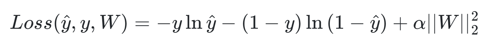
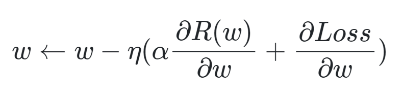

# Laboratorio 1 - Clasificación

## Integrantes

Natalia Sanabria Forero - 201532265

Jorge Esguerra - 201719920

Christian Forigua - 201713023

## Nivel de calidad de los datos y tareas de transformación
Gracias a un análisis exploratorio inicial se pudo determinar la calidad de los datos. Se determinó que un regsitro tenía valores nulos. Así mismo, comparando con el diccionario proporcinado, se encontraron 5 y 35 registros con valores inválidos para las variables de glucosa y presión sanguínea respectivamente. Adicionalmente, para la variable de edad se encontró que 2 registros tenían valores inválidos. 
Adicionalmente, en la exploración se encontraron 2 variables categóricas: "Hair Color" y "City". Para poder trabajar con modelos como KNN, árboles de decisión y redes nuronales es necesario transformar estas variables categóricas a valores que puedan ser procesados por los modelos. Los modelos interpretan valores númericos, por lo que las variables que están en texto natural deben ser transformadas a un dominio diferente. Por ejemplo, los valores de "Red", "Black" y "Blue", de la variable "Hair Color", pueden ser transformados a 0,1 y 2 respectivamente. Sin embargo, dado el contexto clínico del problema, consideramos que la variable de "Hair Color" no es un indicador válido para el diagnósitco de la díabetes, por lo que está varibale no fue tomada en cuenta para el entrenamiento de los modelos. De manera similar, la varibale "City" solo contaba con un único valoe ("New York"). Consideramos que esta información no aporta para el entrenamiento del modelo y por esto, tampoco será tomada en cuenta. 

## Preprocesamiento de los datos

## Modelos
### Árbol de decisión (Jorgue Esguerra)

### KNN (Natalia Sanabria)

### Redes neuronales (MLP) (Cristhian Forigua)
El modelo de MLP tiene múltiples hiperparámetros que se pueden variar para construir el clasificador. Sin embargo, únicamente nos concentramos en parámetros que alteren la arquitectura de la red y el esquema de entrenamiento en pro de alcanzar el mejor resultado posible. Para modificar la arquitectura se propone variar las capas ocultas de la red y la función de activación. Por otra parte, para variar el esquema de entrenamiento, se propone variar el método de optimización de los parámetros de la red.

Para la metodología de entrenamiento se probó Stochastic Gradient Descent (SGD) y Adam. Sin embargo, para los experimentos de las capas ocultas se seleccionó Adam. Tanto SGD como Adam soportan entrenamiento por batches, lo cual agiliza la convergencia del entrenamiento y generaliza la actualización de los pesos. Sin embargo, Adam ajusta automaticamente la tasa de aprendizaje, la cual determina la escala con la que serán actualizados los parámetros. El ajuste de la tasa de aprendizaje permite que el entrenamiento se ajuste con el paso del tiempo. A medida que el modelo se acerca a la convergencia los cambios deben ser más pequeños para seguir minimizando la función de perdida. Por lo anterior, se seleccionó Adam como optimizador.
El número de iteraciones determina cuantas veces se van a a actualizar los pesos de la red. Idealmente, tiene que ser un número lo suficientemente grande que permita al modelo llegar a la convergencia. Por lo anterior, se dicidió iterar el modelo 30.000 veces como máximo.
Así mismo, se decidió utilizar la función de activación ReLU ya que es ampliamente usada en modelos de clasificación. Se probó con todas las funciones de activación proporcionadas por sklearn (‘identity’, ‘logistic’, ‘tanh’, ‘relu’). Sin embargo, la que dio un mejor resultado fue "relu". Lo anterior puede deberse a que con está función, el modelo se ajusta mejor a los datos de entrada.
La tasa de aprendizaje determina la maginutd del cambio en los pesos. A pesar de que Adam ajusta dicho valor, es necesario establecer una tasa de aprendizaje inicial. Se decidió utilizar una tasa de 0.001 que es lo comunmente usado en modelos de aprendizaje profundo.

Finalmente, se cambió la arquitectura de la red nueronal. Se probaron arquitecturas con 1, 3 y 5 capas ocultas variando el número de neuronas entre 5 y 51 con un paso de 1. El mejor modelo se obtuvo con una arquitectura de 3 capas neuronales, con 31,62 y 31 neuronas respectivamente. Este modelo tuvo una cobertura del **0.825**. Una estructrua muy compleja puede llevar a un sobreajuste de los datos teniendo en cuenta la cantidad disponible para entrenamiento. Por otra parte, un modelo muy simple no representaría de manera adecuada el contexto del problema y tendría un bajo poder de generalización. Esto explica porque una estructura de 3 capas neuronales da el mejor resultado pues, según los datos disponibles, no es lo suficientemente compleja para sufrir de sobreajuste ni lo suficientemente sencilla para tener poco poder de generalización.
Una cobertura de 0.825 indica que más del 80% de los casos de diabetes fueron detectados. Esto es útil para el negocio ya que se busca un clasificador que detecté la mayor cantidad de casos posible pues, dentro del contexto médico, es mucho peor no detectar un paciente con diabetes, a detectar un paciente como diabético cuando este realmente no lo es. El resultado obtenido por el MLP tiene una alta cobertura, por lo que podría ser de útilidad para SaludAlpes.
## Comparación de los modelos
A continuación, se puede observar una tabla que contiene el rendimiento de los 3 modelos en términos de la cobertura.

| Modelo| Cobertura |
| --- | --- |
| KNN | - |
| Árbol de decisión| - |
|MLP|0.825|

## Funcionamiento de los modelos
### Árbol de decisión (Jorgue Esguerra)

### KNN (Natalia Sanabria)

### Redes neuronales (MLP) (Cristhian Forigua)
#### Estructura básica
Los perceptrones multicapa son modelos de aprendizaje supervisados que modelan una función f que mapea desde un espacio de representación de dimensión m hacía un espacio de salida de dimensión o (f(⦁)R^m→R^o). Dado un vector de representación X=[x_1,x_2,…,x_m] y una salida Y, el MLP puede aprender una función no lineal para mapear X→Y y así solucionar problemas de clasificación.

La estructura principal del MLP consiste en una capa de entrada, con una dimensión m, una serie de capas ocultas no lineales y una capa de salida. Esto se puede observar a continuación:

Se puede observar que la capa de entrada se compone de n neuronas que representan los valores del vector de entrada. Por otra parte, cada neurona de las capas ocultas se calcula como una suma ponderada de las neuronas de la capa anterior w_1 x_1+w_2 x_2+⋯w_n x_n, donde w_i son los pesos de los valores de las neuronas de las capas anteriores, seguido de una función de activación no lineal. La capa de salida toma los valores de la última capa oculta y genera una respuesta.
El MLP tiene unos parámetros que necesitan ser estimados para ajustar el modelo a los datos. Estos parámetros vendrían siendo los pesos de las conexiones de cada neurona. Para la estimación de los parámetros, el MLP utiliza la retropropagación para optimizar los pesos. Para esto, calcula una función de pérdida según las predicciones del modelo y las anotaciones de la base de datos. Posteriormente, utiliza el gradiente de dicha función de perdida para actualizar los parámetros del modelo, y así minimizar la función de perdida. Este proceso se realiza de manera iterativa hasta que se llega a una convergencia en el problema de optimización.
##### Función de perdida
Como se mencionó anteriormente, el método de optimización funciona utilizando los gradientes de la función de perdida para actualizar los pesos de la red. Por lo anterior, es importante definir el concepto de función de perdida. Esta es una función que se encarga de medir el error entre las predicciones de la red y las anotaciones para un conjunto de datos. El MLPClassifier de sklearn solo soporta Cross_Entropy_Loss como función de perdida. 
Antes de proceder, es necesario aclarar que se tiene un problema de clasificación binario (Diagnóstico positivo o negativo). Por lo anterior, la red considerará como positivo a cualquier entrada que en la capa de salida de como resultado un valor igual o superior a 0,5. De lo contrario, se considerará un ejemplo negativo.  Ahora bien, dado que es un problema binario, el Cross_Entropy_Loss para un problema binario se define como:

En donde y es la anotación, y gorro es la predicción del modelo y $W$ son los parámetros de la red. El término ||W||_{2}^{2} es un L_2 que penaliza los modelos complejos.

#### Optimización
El MLP empieza con parámetros aleatorios. A medida que transcurre el entrenamiento, el MLP minimiza la función de perdida actualizando los parámetros durante varias iteraciones. Una vez se calcula el error, este se retropropaga desde la capa de salida hacía todas las capas anteriores de la red. Esto permite que cada parámeto se actualice en pro de disminuir el error. 
Para la retropropagación primero se calcula el gradiente del error con respecto a los pesos $W$ del modelo y se utiliza para actualizar los pesos de la capa anterior, tal y como se muestra a continuación:

En donde *Loss* es el valor de la función de pérdida y *n* es la tasa de aprendizaje.

#### Tasa de aprendizaje
La tasa de aprendizaje es la magnitud de la actualización, en base al gradiente, para cada peso de la red. Esta determina que tan fuerte van a cambiar los pesos de la red con iteración de la retropropagación.
#### Ventajas
El MLP es capaz de aprender modelos no lineales gracias a la función de activación. Se puede ajustar a datos que no puedan ser explicados a través de modelos lineales.

#### Desventajas
El MLP es sensible a la inicialización. Por la inicialización de los pesos y la optimización, existen varios mínimos locales. Por lo anterior, una inicialización diferente puede llevar a un resultado diferente en el conjunto de test.

El MLP tiene múltiples hiperparámetros que deben ser seleccionados por el usuario.

El MLP es sensible a la escala los vectores de entrada.
